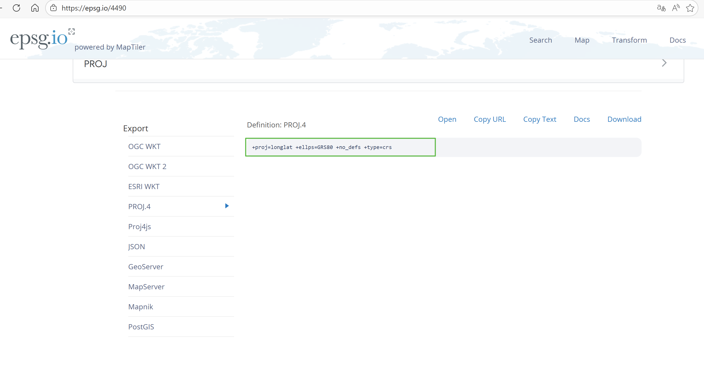
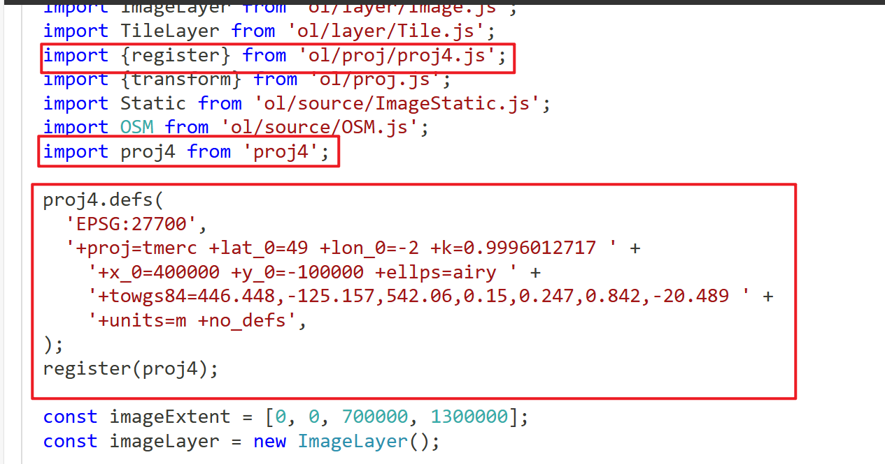

# 在线地图
该篇主要介绍 ol 怎么加载常用的天地图、高德地图、百度地图等。   
天地图要先到[官网](http://lbs.tianditu.gov.cn/server/MapService.html)申请Key，赋值给url中的tk。       
Google Map中国、高德和腾讯都采用的火星坐标系，百度地图在火星坐标系的基础上进行了二次加密。 若系统接入的其他地理数据是和底图一样的坐标系，则不需要对底图做其他操作； 若系统接入的地理数据是真实坐标，则需要对底图进行纠偏处理。  
Openlayers 中默认支持的坐标系为EPSG:4326和EPSG:3857，除此外的坐标需自定义，可以先到[EPSG 官网](https://epsg.io/)获取对应坐标系的元数据，对于EPSG官网上定义的坐标系，可以通过[proj4](https://www.npmjs.com/package/proj4)库注册使用。可以参考[官方示例1](https://openlayers.org/en/latest/examples/reprojection.html)、[官方示例2](https://openlayers.org/en/latest/examples/reprojection-image.html)。  
对于火星坐标系和百度坐标系，可以使用[projzh](https://www.npmjs.com/package/projzh?activeTab=readme)  。  

<demo vue="./Online.vue" />