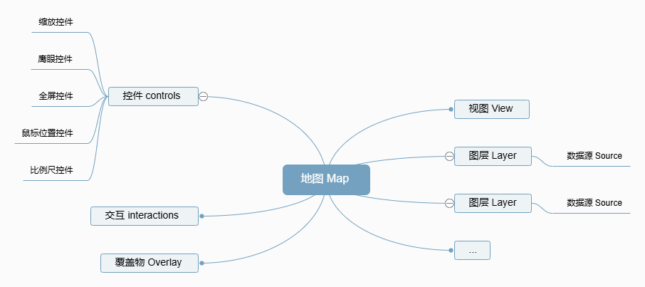

# 介绍

OpenLayers 是开源的前端地图引擎，主要用于二维地图渲染。功能齐全，API 丰富，支持多种地图投影和图层类型。

## 地图组成
Map 是 OpenLayers 的核心组件，其构成如下

- 一个地图有一个 View 对象，控制地图的中心点、缩放比例、旋转，view 有一个 projection 属性，决定了地图的坐标系，默认是 Web墨卡托(EPSG:3857)。
- 一个地图可以有多个图层，一个图层对应一个数据源。
- 控件是固定在屏幕上的 DOM 元素，位置和样式由 css 控制。
- Interaction 与 DOM 元素无关，是一些改变地图状态的用户行为，比如ol/interaction/DoubleClickZoom.js允许用户双击缩放地图。
- Overlay 显示在地图上的 DOM 元素，并且和地理坐标关联，不会固定在屏幕位置上，当拖动地图时，Overlay 也会跟随移动，永远和关联的地理坐标保持相对的屏幕位置。常用作展示和地理要素关联的业务信息。

## 相关文档

[OpenLayers 官方网站](https://openlayers.org/)  
[OpenLayers 教程（基础知识通俗易懂）](https://linwei.xyz/ol3-primer/ch01/index.html)  
[OpenLayers 扩展库](https://viglino.github.io/ol-ext/)
