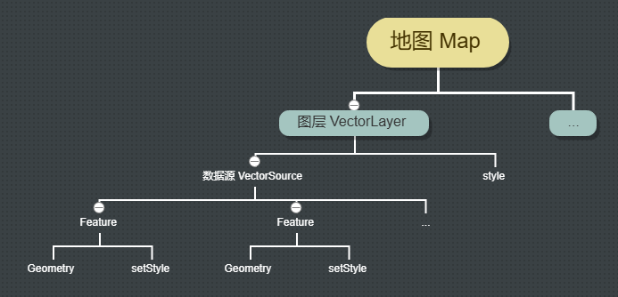
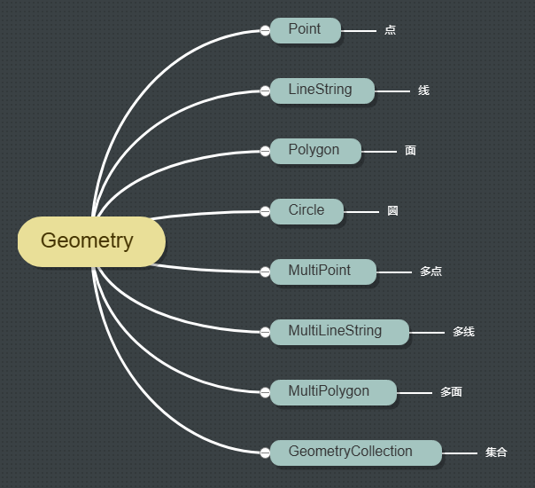
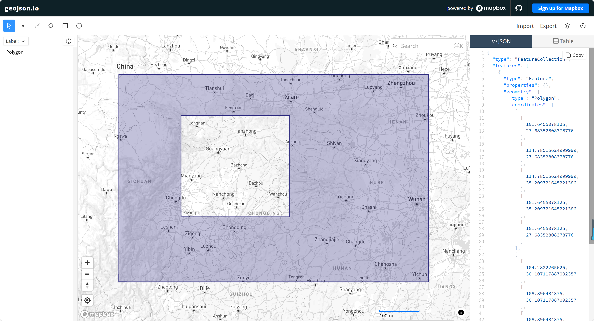
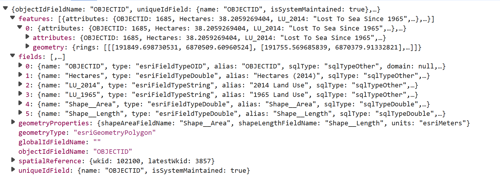

# 介绍

地图引擎里常用图形分为点、线、面、多点、多线、多面等，图形不仅要考虑几何形状还要考虑样式。
在不规则图片点位与鼠标交互时要注意透明的部分不可交互。

## 地图、图层、图形的关系

- 一个地图可以有多个矢量图层
- 一个矢量图层对应一个数据源
- 一个数据源里可以有多个矢量图形
## 常用图形

## 常用JSON格式
### GeoJSON
GeoJSON 是一种对各种地理数据结构进行编码的格式。  
官方网站：[https://geojson.org](https://geojson.org/)  
  
示例：
````json
{
    "type": "FeatureCollection",
    "features": [{
        "type": "Feature",
        "geometry": {
            "type": "Point",
            "coordinates": [102.0, 0.5]
        },
        "properties": {
            "prop0": "value0"
        }
    }, {
        "type": "Feature",
        "geometry": {
            "type": "LineString",
            "coordinates": [
                [102.0, 0.0],
                [103.0, 1.0],
                [104.0, 0.0],
                [105.0, 1.0]
            ]
        },
        "properties": {
            "prop0": "value0",
            "prop1": 0.0
        }
    }, {
        "type": "Feature",
        "geometry": {
            "type": "Polygon",
            "coordinates": [
                [
                    [100.0, 0.0],
                    [101.0, 0.0],
                    [101.0, 1.0],
                    [100.0, 1.0],
                    [100.0, 0.0]
                ]
            ]
        },
        "properties": {
            "prop0": "value0",
            "prop1": {
                "this": "that"
            }
        }
    }]
}
````
需要注意的是带环的多边形的数据格式，坐标数组中第一个元素是外环，其他都是内环，外环界定了外轮廓，而内环界定了外轮廓内的孔。
````json
{
      "type": "Feature",
      "properties": {},
      "geometry": {
        "type": "Polygon",
        "coordinates":[
            [
                [101.6455078125,27.68352808378776],
                [114.78515624999999,27.68352808378776],
                [114.78515624999999,35.209721645221386],
                [101.6455078125,35.209721645221386],
                [101.6455078125,27.68352808378776]
            ],
            [
                [104.2822265625,30.107117887092357],
                [108.896484375,30.107117887092357],
                [108.896484375,33.76088200086917],
                [104.2822265625,33.76088200086917],
                [104.2822265625,30.107117887092357]
            ]
        ]
    }
}
````
[geojson.io](https://geojson.io/next/)是一个基于 Web 的编辑器，可以在其中导入和导出 GeoJSON 数据。它还在并排窗格中显示 GeoJSON 代码和可视化输出。

### EsriJSON
EsriJSON 是由 Esri 公司定义的一种扩展的 GeoJSON 格式，用于表示地理空间要素及其属性信息。与标准的 GeoJSON 相比，EsriJSON 增加了一些属性和元素，以支持 Esri ArcGIS 产品族的规范。  
EsriJSON 文件必须至少包含以下属性：
- geometryType：几何类型
- spatialReference：空间参考
- fields：字段
- features：要素（具有几何和特性）
- 