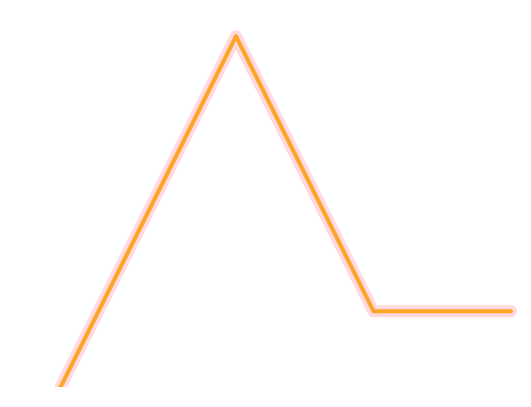
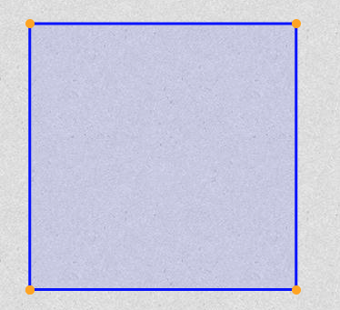
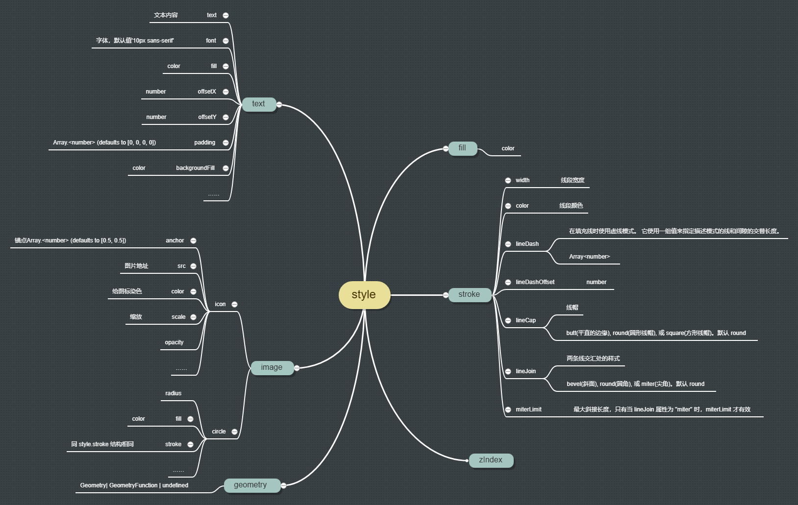

# style 格式说明

style 既可以是一个对象、一个数组，也可以是一个函数

1. 最常见的是对象 style（可滚动到本页面最下方查看脑图）。而style对象属性中最常用的是 **fill、stroke、image**。 对象中要用什么属性则取决于要赋予样式的矢量类型。
   - 如果是 **面**， 则要用到 **fill** 来指定面的填充色，**stroke** 来指定面的边框样式（颜色、宽度等）；
   - 如果是 **线**， 则只需要 **stroke** 来指定线的样式；
   - 如果是 **点**， 则只需要 **image** 属性，当然 image 对象的属性也分了两种：icon 与 circle， icon 代表点样式是用图标表示的，circle 则代表点样式是一个圆点；
   - 当然这些属性都可以同时使用，但是你要清楚到底是哪些属性分别对地图上的点、线、面起了作用

2. 再说说 **text** 与 **zIndex**。
   - **text** 是用来指定文本样式的。例如我们给面指定好 fill 与 stroke 之后，还想要在面上显示文字就可以用这个属性。 或者我们想在点位旁边显示文字，也可以为点位指定文本样式。
   - **zIndex** 是用来指定样式层级。例如同一图层的点位，想要让第一种类型的点位在第二种类型点位的上方， 就可以给第一种类型点位的样式的zIndex设置个更大的值
   - 还有 **geometry** ，用来为图形添加另外的图形作为样式的一部分。想要了解更多可阅读该示例： [https://openlayers.org/en/latest/examples/line-arrows.html](https://openlayers.org/en/latest/examples/line-arrows.html)

3. 其次是函数 style。函数 style 接收两个参数：feature 与 resolution，返回对象 style 或者 数组 style。 主要用在为 layer 设置样式上，可以根据矢量上携带的信息为每个矢量返回不同的样式

4. 最后是数组 style。用在为一个矢量设置多个样式，例如你可以为线设置两个 style，一个 style 的线宽些， 另一个窄一些，你就可以得到两条中心一致的线；或者你也可以一个 style 设置线的样式，另一个 style 设置 geometry，为线段两段绘制端点。 想要了解更多，可查看示例： [https://openlayers.org/en/latest/examples/polygon-styles.html](https://openlayers.org/en/latest/examples/polygon-styles.html)

   
   

